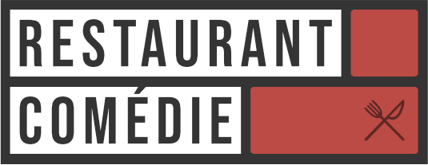
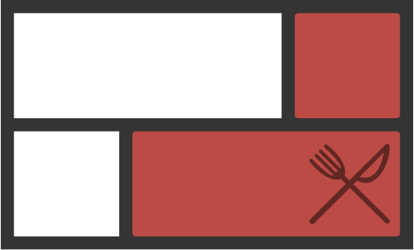
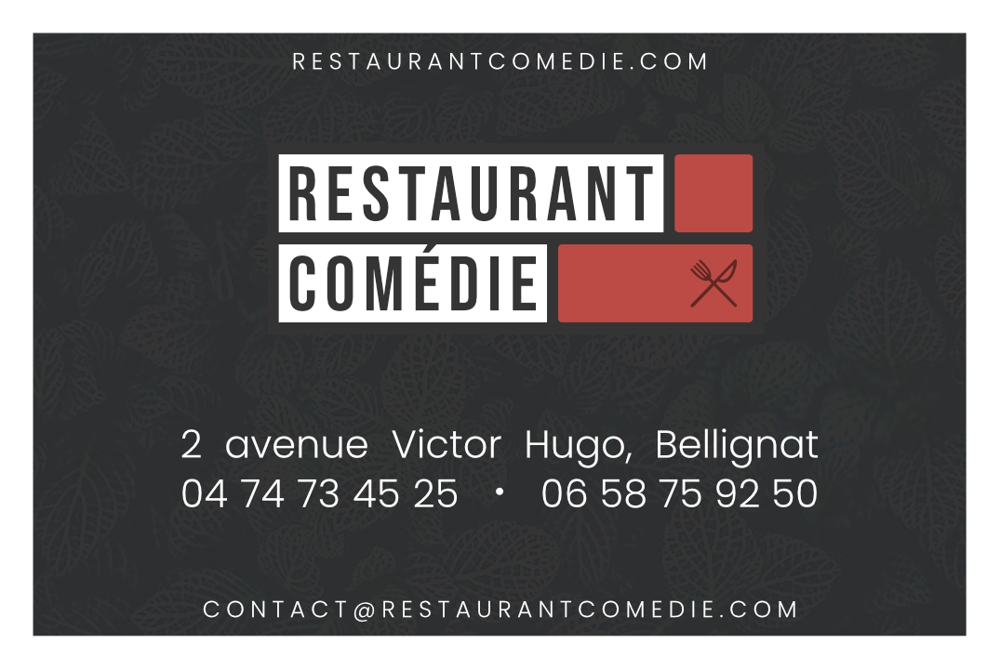
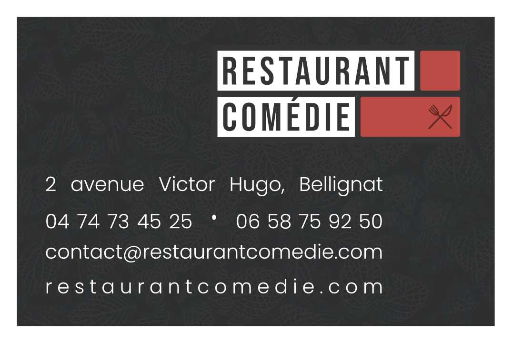
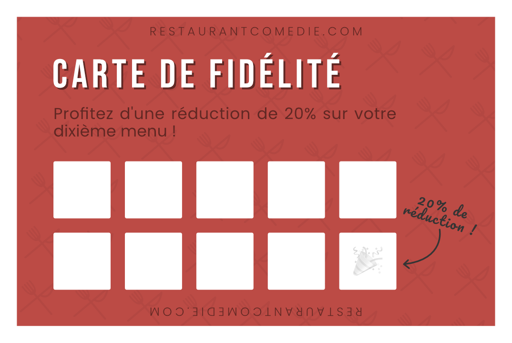

# Restaurant Comédie

Le restaurant Comédie est un restaurant d'affaires situé à Bellignat (01). J'ai réalisé en 2020 leur nouveau logo, accompagnant la redécoration de leur salle de restauration.

Le logo s'inspire de deux briques rouges, rappelant les nouveaux murs en briquettes rouge de style industriel qui accentue le nouveau décor de la salle.

L'image du restaurant étant grandement rattachée à ses gérants, ce logo se veut plutôt neutre mais distinctif. Cette distinction est d'ailleurs réutilisée pour créer la favicon du site (non encore publié).

Qui dit nouveau logo dit aussi nouvelle carte de visite.

Une deuxième version du recto a été créée.

Au verso de cette carte se trouve une carte de fidélité.

