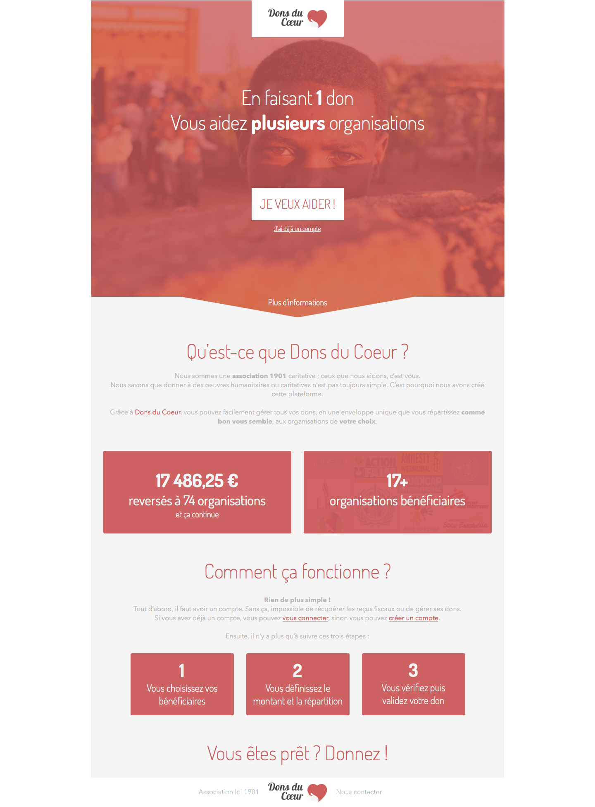

# Dons du coeur

Plateforme fictive de gestion de dons. Celle-ci permettrait à un particulier de faire des dons à plusieurs bénéficiaires à partir d'un seul versement bancaire. La plateforme serait un simple intermédiaire permettant de simplifier les prélèvements et d'avoir un tableau de bord ainsi qu'un historique de tous les dons de l'utilisateur.

