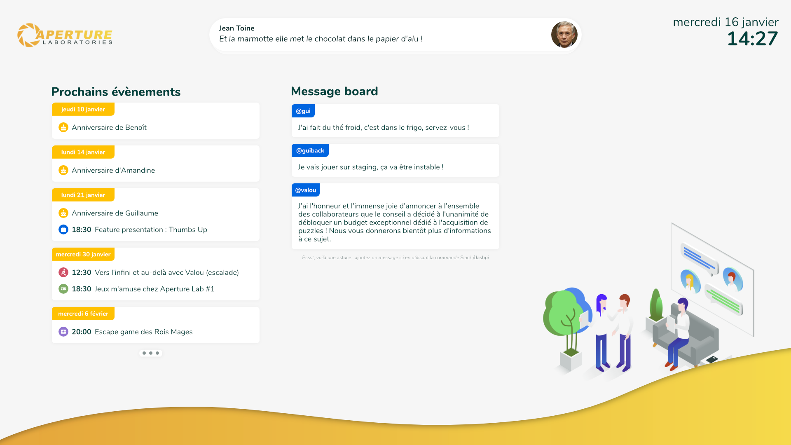
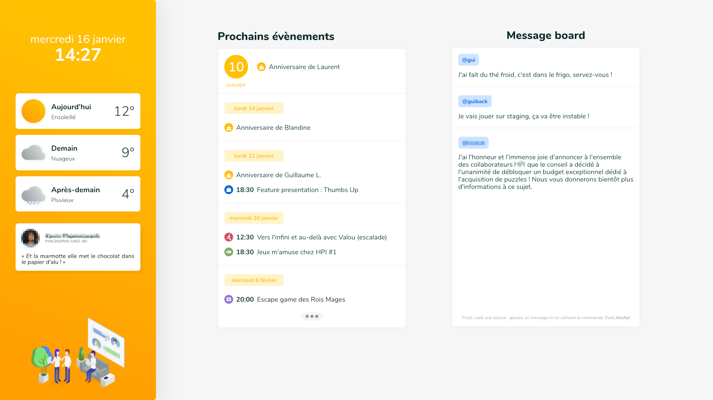

# Dashboard (🚧)

Ce dashboard avait été imaginé pour être affiché sur un écran d'accueil lors de l'un de mes précédents postes. Il devait afficher un calendrier des prochains événements ainsi qu'une section de messages libres (connectée à Slack) et quelques autres widgets.

Le design est inspiré de la charte graphique des produits de l'entreprise où j'ai travaillé. Certaines données ont été changées ou floutées pour rester neutre.

*Note : je ne suis pas l'auteur de l'illustration utilisée en bas à droite sur le premier rendu et en bas à gauche sur le deuxième rendu.*

Voici une version alternative du design.

