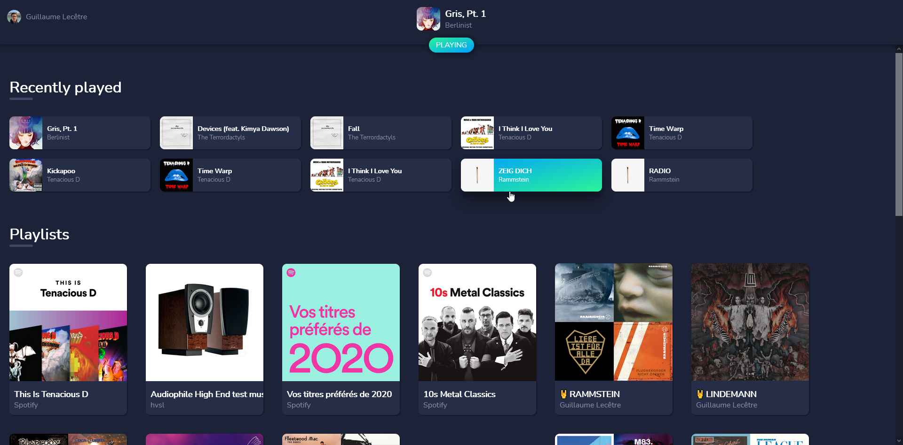

# Vutify

Ce site web développé avec le framework Vue est un lecteur web Spotify fonctionnel. Après connexion à son compte Spotify, il affiche les dernières lectures ainsi que les playlists de l'utilisateur.

La lecture ne peut démarrer depuis le site mais un lecteur apparaît dans l'application Spotify et permet de lancer la musique. Lorsque c'est fait, l'utilisateur peut mettre en pause et reprendre la lecture depuis le site web.

